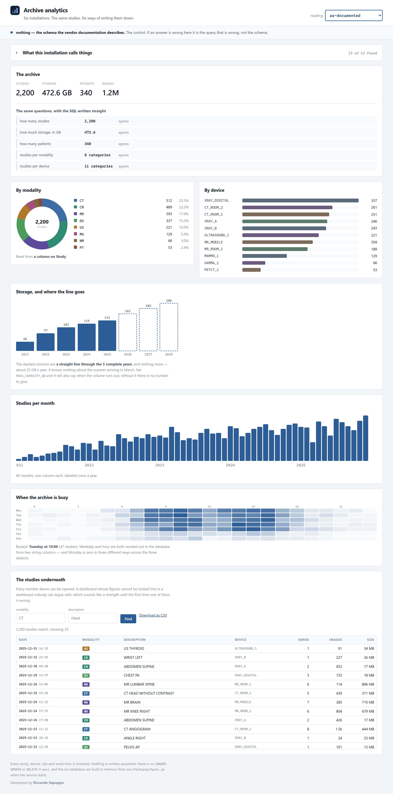
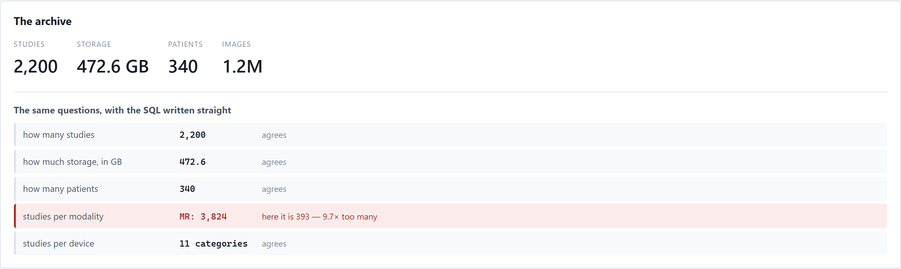
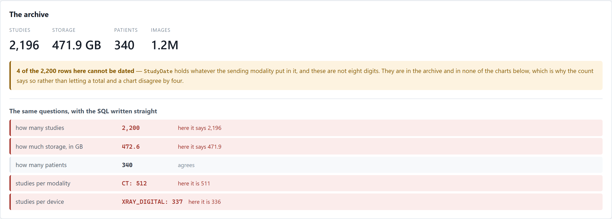
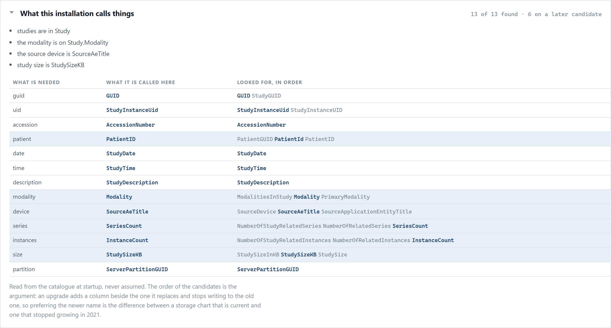
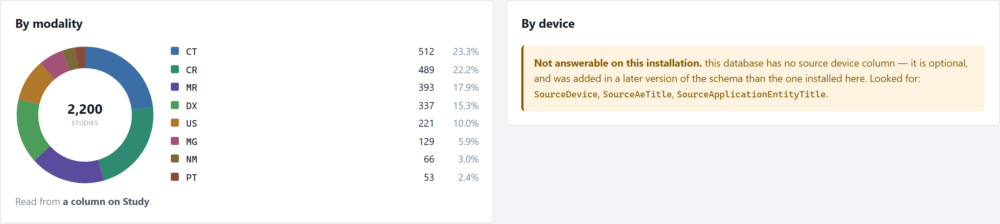

# Archive analytics

Counting the studies in a medical image archive: how many, how big, which
machine, which month. The kind of dashboard every product of this sort has.

The argument is not the dashboard. It is this:

> **You are reporting on a database you do not own, cannot change, and that is
> different at every installation — and the way that goes wrong is usually not
> an error.**



## Where this came from

The original was a route inside a much larger PACS viewer: a few thousand lines
that answered exactly these questions for a fleet of hospital installations of
the same archive software. What is worth reproducing is not the charts. It is
what those thousands of lines had learnt about the databases they were pointed
at, one incident at a time:

- **the same quantity is called three different things.** `StudySizeInKB`,
  `StudySizeKB`, `StudySize` — depending which version somebody upgraded from,
  and whether they ran the rename step;
- **the modality is not on the table the documentation puts it on.** It lives on
  `Series`, one row per series, reached through a foreign key;
- **a column can simply not be there.** The source device is optional and
  arrived in a later schema version;
- **the dates are `VARCHAR(8)`**, holding a DICOM `YYYYMMDD` — which is to say
  holding whatever the sending modality put in them;
- and the whole thing might be **SQL Server or PostgreSQL**, decided by probing,
  because the configuration says a connection string exists and not that
  anything is listening on it.

None of that is fixable from where the analytics stands. You do not own the
schema, you cannot migrate it, you will not be told when it differs. You get to
run `SELECT`.

**What is not reproduced**, and why: the original also read the connection
string out of the archive product's own configuration file, and had one write
path — queueing a study to be burnt to disc — which was disabled by default,
refused itself, and needed the vendor's services running to do anything. Neither
belongs in a public repository: the first is a path on somebody's server and the
second is a write into somebody's queue. What is here is the half that
transfers, which is all of the reasoning and none of the customer.

## The measurement

```
npm run measure
```

Eight questions. Six installations **holding the same studies** and disagreeing
only about how to write them down. Two ways of answering each. So every question
has one right answer, worked out from the facts in plain JavaScript by
[`src/measure/truth.js`](src/measure/truth.js) — never by running a query,
because an expectation computed the way the answer is computed agrees with a
bug.

```
installation          SQL written straight              the schema read first
as-documented         8 right                           8 right
older-column-names    4 right   4 patched               8 right
modality-on-series    7 right   1 SILENT                8 right
no-device-column      8 right                           8 right
undatable-rows        3 right   5 SILENT                8 right
combined-modalities   7 right   1 SILENT                8 right
```

**Four outcomes, not two**, because the difference between them is the subject:

| | |
|---|---|
| `right` | ran as written, and matches the facts |
| `patched` | errored, and the obvious one-line repair was right |
| `loud` | errored, and nothing obvious repairs it |
| **`SILENT`** | ran, answered, and was wrong |

The first three share the only property that matters: **somebody knows.** A
query that cannot find a column stops the page and gets fixed on Monday. A query
that joins a one-to-many table returns numbers nine times too large, keeps the
shape of the chart, and is believed — because a number on a dashboard is
believed.

> **Seven of forty-eight answers were wrong with nothing to show for it.**

### The baseline is not built to lose

On the installation whose schema matches the documentation it gets **all eight
right**, which is what it should do: it is the query anybody writes first,
correctly, having read the schema they were given. Where it cannot run at all,
the patches are the obvious repair rather than a bad one. And where the device
column is missing it is *right* to refuse, which is scored as right.

A comparison that had to be rigged to win would not be worth running, so
[a browser check](tools/through-the-screen.mjs) asserts that nothing is marked
wrong on `as-documented`.

## The three that hurt

### A join, where the modality lives on another table



There is no modality on `Study`, so the documented query errors and the obvious
repair joins `Series`. The join is written correctly. `Series` is also
**one-to-many**: every study is counted once per series it contains, and its
storage goes along with it.

Nothing errors. The chart keeps its shape. The proportions change too, because
CT and MR have the most series — so the picture is not even uniformly wrong.

The fix is not "avoid the join". It is that **the right query depends on what is
being counted**: counting studies per modality, a join is right as long as it
counts `DISTINCT` studies; summing anything belonging to the study across that
join is wrong however it is counted. So the summary uses a correlated subquery
with `MIN`, which returns exactly one row per study whatever `Series` contains,
and the modality chart uses a join with `COUNT(DISTINCT)` and gets its storage
from a second query. Two different correct answers to "where is the modality",
chosen by what is being asked.

### Four rows that cannot be dated



`StudyDate` is a `VARCHAR(8)` with no constraint on it and never had one — the
archive's job is to accept the study, not to argue with the scanner about
formatting. Over a few years it collects `NULL`, `''`, a human-readable date,
and the occasional word.

Four of them here are enough to make **five answers wrong at once**, by ones and
twos, and to grow buckets called `2024-0` and `UNKNOW` on the monthly chart.

Every dated query carries the same guard — eight characters, all of them digits
— and **every answer says how many rows the guard removed**. A headline count
that includes them beside a chart that excludes them is a page that contradicts
itself by four, which nobody can see in a bar chart and everybody eventually
asks about.

### A field that holds two modalities

`ModalitiesInStudy` is multi-valued in the standard — value multiplicity 1-n,
backslash delimited — so `CT\MR` is a correct value for a study containing both.
It is also a value a `GROUP BY` turns into a category that is neither, while
taking the count away from both: CT drops from 512 to 459 and a slice appears
that no radiologist has ever ordered.

The split is done after the group, in the application, because splitting a
delimited string is a different function in each of the three dialects. The
consequence is stated rather than hidden: a study with two modalities is counted
under both, so **the column adds to more than the archive holds**, and the page
says by how many.

## What it found in the schema, shown



Read from the catalogue at startup, never assumed. The order of the candidates
is the argument: an upgrade adds a column beside the one it replaces and stops
writing to the old one, so preferring the newer name is the difference between a
storage chart that is current and one that stopped growing in 2021.

Every number on the page can be traced to a column, and the column can be traced
to the candidate list it came out of.

## And where it cannot answer at all



The source device column is optional. A site that upgraded the application
without the schema step does not have it.

**"This cannot be answered here, and here is why" is a correct answer.** The
alternatives are worse in both directions: crashing the page because one panel
of six is unavailable, or drawing an empty chart — which a reader reasonably
takes to mean "no studies" rather than "no column".

## Before you start

- **Node 24 or newer**, and nothing else at all. No database to install, no
  container, no account, no key. `node:sqlite` is in the runtime, so the six
  installations are built in memory from
  [`src/fixtures/facts.js`](src/fixtures/facts.js) when the service starts.
- **No runtime dependencies.** `npm install` fetches `playwright-core`, which is
  a devDependency for the two browser-driven checks and drives the **Microsoft
  Edge** already on this machine rather than downloading a browser.
- **Nothing is written anywhere.** There is no `INSERT`, `UPDATE` or `DELETE` in
  `src/`, and a CI step greps for them so that stays true.
- **To put the machine back:** delete `node_modules/` and the clone.

## Run it

```
npm install
npm start
```

The console opens by itself on <http://127.0.0.1:3800>. Not in CI, not without a
terminal, and not with `--no-open` or `NO_OPEN=1` — and it says which of those
happened.

**One control matters**, and it is the select at the top. Changing the
installation swaps the database under the dashboard: the numbers on the page do
not move, and the ones under *the same questions, with the SQL written straight*
do.

```
npm start -- --port 3800 --no-open
PACS_CAPACITY_GB=2000 npm start        # and it will say when the volume runs out
```

## Three dialects, one of them executed

Every query is assembled from small pieces in [`src/db/dialect.js`](src/db/dialect.js)
rather than written out, so the same question can be asked of SQLite, SQL Server
or PostgreSQL without three copies drifting apart.

**SQLite is executed.** It is in the runtime, so the measurement, the tests and
the service all really run, against six real databases.

**SQL Server and PostgreSQL are checked as text.** `npm run check:dialects`
asserts what the builder emits, statement by statement. That is a weaker claim
and this is the only honest way to put it:

> it proves the builder produces the dialect it means to.
> **it does not prove any server accepts the result.**

What it asserts is the load-bearing, dialect-specific part — the places where
getting it wrong is a syntax error on a server nobody here can ask:

| | |
|---|---|
| quoting | `[brackets]` against `"double quotes"` |
| parameters | `@p1` against `$1`, and never a bare `?` |
| counting | `COUNT_BIG` against `COUNT`, because `COUNT` is `int` on SQL Server and overflows |
| the date guard | `NOT LIKE '%[^0-9]%'` against `~ '^[0-9]+$'` |
| rounding | cast to `numeric` on PostgreSQL, where `round(double precision, int)` does not exist |
| the weekday | Monday is zero in three different ways |

Not a golden file. A frozen copy of the SQL fails on every harmless change of
whitespace and gets regenerated without being read, which is how a golden test
becomes a rubber stamp.

## What it is checked with

```
npm test               # 48  the guards, the resolution, the answers, the CSV
npm run measure        #     the claim, against six installations
npm run check:dialects # 23  what the two unexecuted dialects emit
npm run check:screen   # 23  the console, driven with a browser
npm run check:serving  # 33  nobody can be handed yesterday's page
npm run check:mark     #     the header mark and the tab icon are one drawing
npm run screenshots    #     retakes the pictures above
```

`npm run measure` **fails the run** if the side that reads the schema is not
right everywhere. That is not a threshold to watch: the six hold the same
studies, so anything other than the same answers is a defect.

The browser checks start their own service on a port nothing else uses, and stop
it again. A check that fetched a fixed address and hoped somebody had started
something passes on a machine where anything is listening there — against
whatever that is.

## What it still gets wrong

Named here rather than left to be discovered.

**Six installations is not a fleet.** These are the four kinds of drift the
original had met, plus two data problems. A real fleet has kinds nobody has
thought of, and the honest claim is that the *shape* of the answer transfers,
not that the candidate lists are complete.

**Two dialects are unexecuted**, as above.

**The forecast is a straight line and says so.** It knows nothing about the
scanner arriving in March. It refuses below three complete years — two points
define a line exactly, which is why a forecast from two years looks so
convincing — and it drops the current year, because a part-year fitted as a
whole one makes every one of these charts turn downwards at the right edge and
announce that the archive is shrinking.

**Nothing here does incremental indexing.** Rebuilding costs a fraction of a
second on a corpus this size; a real deployment needs the incremental version of
the same argument, not a way around it.

---


Developed by **Riccardo Sapuppo**.
